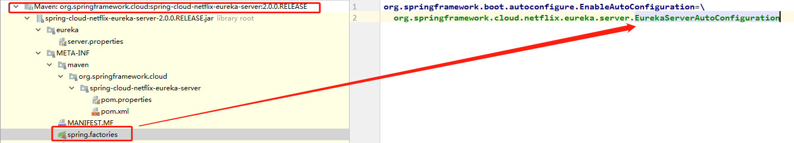

## springcloud-eureka

###Describle: 

#### Eureka：

Eureka Server：注册中心服务端，用于维护和管理注册服务列表

Eureka Client：注册中心客户端，向注册中心注册服务的应用都可以叫做Eureka Client（包括Eureka Server本身, 因为 Eureka Server 本身也是可以注册到注册中心的）

Eureka 注册中心启动, 会加载 EurekaServerConfig 和 EurekaClientConfig 配置的相关连接信息(有点类似 JDBC 连接数据库那部分配置)

ApplicationInfoManager(Sinleton): 初始化注册到Eureka服务器所需信息和其他组件

EurekaClient: 负责管理注册到注册中心的客户端, 数据的存储, 缓存, 剔除, 更新

InstanceRegistry: 处理所有来至 eureka 客户端注册表请求

.jpg)

####version

```pom
<dependency>
  <groupId>org.springframework.cloud</groupId>
  <artifactId>spring-cloud-dependencies</artifactId>
  <version>Finchley.RELEASE</version>
</dependency>
<dependency>
  <groupId>org.springframework.boot</groupId>
  <artifactId>spring-boot-dependencies</artifactId>
  <version>2.0.5.RELEASE</version>
</dependency>
```



###Eureka 注册中心启动原理

####EurekaServerAutoConfiguration

```java
/*
 * Copyright 2013-2017 the original author or authors.
 *
 * Licensed under the Apache License, Version 2.0 (the "License");
 * you may not use this file except in compliance with the License.
 * You may obtain a copy of the License at
 *
 *      http://www.apache.org/licenses/LICENSE-2.0
 *
 * Unless required by applicable law or agreed to in writing, software
 * distributed under the License is distributed on an "AS IS" BASIS,
 * WITHOUT WARRANTIES OR CONDITIONS OF ANY KIND, either express or implied.
 * See the License for the specific language governing permissions and
 * limitations under the License.
 */
/**
 * @author Gunnar Hillert
 * @author Biju Kunjummen
 * @author Fahim Farook
 * eureka-server 自动配置类
 * xxx.yml 配置文件里面的信息在程序启动就已经被加载, 这部分属于 boot 启动时加载
 */
@Configuration
@Import(EurekaServerInitializerConfiguration.class)
@ConditionalOnBean(EurekaServerMarkerConfiguration.Marker.class)
@EnableConfigurationProperties({ EurekaDashboardProperties.class,
		InstanceRegistryProperties.class })
@PropertySource("classpath:/eureka/server.properties")
public class EurekaServerAutoConfiguration extends WebMvcConfigurerAdapter {
	/**
	 * List of packages containing Jersey resources required by the Eureka server
	 */
	private static final String[] EUREKA_PACKAGES = new String[] { "com.netflix.discovery",
			"com.netflix.eureka" };

	@Autowired
	private ApplicationInfoManager applicationInfoManager;

	@Autowired
	private EurekaServerConfig eurekaServerConfig;

	@Autowired
	private EurekaClientConfig eurekaClientConfig;

	@Autowired
	private EurekaClient eurekaClient;

	@Autowired
	private InstanceRegistryProperties instanceRegistryProperties;
	
   	// 1 开始准备工作
  	// 说明: 关于类加载属性方法静态属性静态方法加载顺序, 这个是 jvm 类加载相关资料, 可以自行了解, 其实从这里也可以看出来
  	// 静态属性初始哈 CloudJacksonJson extends LegacyJacksonJson 所以先加载父类
  	// LegacyJacksonJson 中 protected final EurekaJacksonCodec codec = new EurekaJacksonCodec();
  	// EurekaJacksonCodec 参考下面描述 1.1
  	// 一句话总结: 通过静态属性一步步加载 EurekaClientConfig, 但是加载完还是为 null, 初始化在 eureka server 后
  	// 1.2 上面流程走完, CloudJacksonJson protected final CloudJacksonCodec codec = new CloudJacksonCodec(); 加载自己属性, 作用同 1.1
	public static final CloudJacksonJson JACKSON_JSON = new CloudJacksonJson();

	@Bean
	public HasFeatures eurekaServerFeature() {
		return HasFeatures.namedFeature("Eureka Server",
				EurekaServerAutoConfiguration.class);
	}

  	// 3 此处加载 eureka server managere 配置信息(可以自己重写), 上一步是初始化 EurekaClientConfigBean
	@Configuration
	protected static class EurekaServerConfigBeanConfiguration {
		@Bean
		@ConditionalOnMissingBean
		public EurekaServerConfig eurekaServerConfig(EurekaClientConfig clientConfig) {
          	// 相当于配置文件, 此处配置参数, 可以根据实际情况自定义
			EurekaServerConfigBean server = new EurekaServerConfigBean();
            // 是否将自己注册进 eureka 服务中心, 我们这配置文件中为 false
			if (clientConfig.shouldRegisterWithEureka()) {
				// Set a sensible default if we are supposed to replicate
              	// 注册信息同步重试次数, 默认 0, 
				server.setRegistrySyncRetries(5);
			}
			return server;
		}
	}

	@Bean
	@ConditionalOnProperty(prefix = "eureka.dashboard", name = "enabled", matchIfMissing = true)
	public EurekaController eurekaController() {
		return new EurekaController(this.applicationInfoManager);
	}

	static {
      	// 2 加载 eureka 编码器, 用作数据编码解码, 可参考 CodecWrappers 查看具体有哪些实现类
      	// CodecWrappers 工厂类, 用于生产 CodecWrapper
		CodecWrappers.registerWrapper(JACKSON_JSON);
		EurekaJacksonCodec.setInstance(JACKSON_JSON.getCodec());
	}

  	//4 解析 eureka 服务的元数据 CodecWrapper
	@Bean
	public ServerCodecs serverCodecs() {
		return new CloudServerCodecs(this.eurekaServerConfig);
	}

	private static CodecWrapper getFullJson(EurekaServerConfig serverConfig) {
		CodecWrapper codec = CodecWrappers.getCodec(serverConfig.getJsonCodecName());
		return codec == null ? CodecWrappers.getCodec(JACKSON_JSON.codecName()) : codec;
	}

	private static CodecWrapper getFullXml(EurekaServerConfig serverConfig) {
		CodecWrapper codec = CodecWrappers.getCodec(serverConfig.getXmlCodecName());
		return codec == null ? CodecWrappers.getCodec(CodecWrappers.XStreamXml.class)
				: codec;
	}

	class CloudServerCodecs extends DefaultServerCodecs {

		public CloudServerCodecs(EurekaServerConfig serverConfig) {
			super(getFullJson(serverConfig),
					CodecWrappers.getCodec(CodecWrappers.JacksonJsonMini.class),
					getFullXml(serverConfig),
					CodecWrappers.getCodec(CodecWrappers.JacksonXmlMini.class));
		}
	}

  	// 5. 此处为核心开始
	@Bean
	public PeerAwareInstanceRegistry peerAwareInstanceRegistry(
			ServerCodecs serverCodecs) {
		this.eurekaClient.getApplications(); // force initialization
      	// eurekaServerConfig: 服务端管理配置连接信息
      	// eurekaClientConfig: 客户端管理配置连接信息
      	// serverCodecs: 服务信息解析器
      	// eurekaClient: CloudEurekaClient 负责管理注册到 Eureka Server的 client;
      	// ExpectedNumberOfRenewsPerMin: 每分钟心跳次数, 默认 1
      	// DefaultOpenForTrafficCount: 每分钟期望收到得到心跳次数
		return new InstanceRegistry(this.eurekaServerConfig, this.eurekaClientConfig,
				serverCodecs, this.eurekaClient,
				this.instanceRegistryProperties.getExpectedNumberOfRenewsPerMin(),
				this.instanceRegistryProperties.getDefaultOpenForTrafficCount());
	}

	@Bean
	@ConditionalOnMissingBean
	public PeerEurekaNodes peerEurekaNodes(PeerAwareInstanceRegistry registry,
			ServerCodecs serverCodecs) {
      	// 真正开始初始化 eureka 注册中心相关信息
		return new RefreshablePeerEurekaNodes(registry, this.eurekaServerConfig,
				this.eurekaClientConfig, serverCodecs, this.applicationInfoManager);
	}
	
	/**
	 * {@link PeerEurekaNodes} which updates peers when /refresh is invoked.
	 * Peers are updated only if
	 * <code>eureka.client.use-dns-for-fetching-service-urls</code> is
	 * <code>false</code> and one of following properties have changed.
	 * </p>
	 * <ul>
	 * <li><code>eureka.client.availability-zones</code></li>
	 * <li><code>eureka.client.region</code></li>
	 * <li><code>eureka.client.service-url.&lt;zone&gt;</code></li>
	 * </ul>
	 */
	static class RefreshablePeerEurekaNodes extends PeerEurekaNodes
			implements ApplicationListener<EnvironmentChangeEvent> {

		public RefreshablePeerEurekaNodes(
				final PeerAwareInstanceRegistry registry,
				final EurekaServerConfig serverConfig,
				final EurekaClientConfig clientConfig, 
				final ServerCodecs serverCodecs,
				final ApplicationInfoManager applicationInfoManager) {
			super(registry, serverConfig, clientConfig, serverCodecs, applicationInfoManager);
		}

		@Override
		public void onApplicationEvent(final EnvironmentChangeEvent event) {
			if (shouldUpdate(event.getKeys())) {
				updatePeerEurekaNodes(resolvePeerUrls());
			}
		}
		
		/*
		 * Check whether specific properties have changed.
		 */
		protected boolean shouldUpdate(final Set<String> changedKeys) {
			assert changedKeys != null;
			
			// if eureka.client.use-dns-for-fetching-service-urls is true, then
			// service-url will not be fetched from environment.
			if (clientConfig.shouldUseDnsForFetchingServiceUrls()) {
				return false;
			}
			
			if (changedKeys.contains("eureka.client.region")) {
				return true;
			}
			
			for (final String key : changedKeys) {
				// property keys are not expected to be null.
				if (key.startsWith("eureka.client.service-url.") ||
					key.startsWith("eureka.client.availability-zones.")) {
					return true;
				}
			}
			
			return false;
		}
	}

	@Bean
	public EurekaServerContext eurekaServerContext(ServerCodecs serverCodecs,
			PeerAwareInstanceRegistry registry, PeerEurekaNodes peerEurekaNodes) {
		return new DefaultEurekaServerContext(this.eurekaServerConfig, serverCodecs,
				registry, peerEurekaNodes, this.applicationInfoManager);
	}

	@Bean
	public EurekaServerBootstrap eurekaServerBootstrap(PeerAwareInstanceRegistry registry,
			EurekaServerContext serverContext) {
		return new EurekaServerBootstrap(this.applicationInfoManager,
				this.eurekaClientConfig, this.eurekaServerConfig, registry,
				serverContext);
	}

	/**
	 * Register the Jersey filter
	 */
	@Bean
	public FilterRegistrationBean jerseyFilterRegistration(
			javax.ws.rs.core.Application eurekaJerseyApp) {
		FilterRegistrationBean bean = new FilterRegistrationBean();
		bean.setFilter(new ServletContainer(eurekaJerseyApp));
		bean.setOrder(Ordered.LOWEST_PRECEDENCE);
		bean.setUrlPatterns(
				Collections.singletonList(EurekaConstants.DEFAULT_PREFIX + "/*"));

		return bean;
	}

	/**
	 * Construct a Jersey {@link javax.ws.rs.core.Application} with all the resources
	 * required by the Eureka server.
     * 2 eureka 环境信息, 包含了springcloud 自带配置文件, 本地配置信息和从git上获取的配置信息, 
	 */
	@Bean
	public javax.ws.rs.core.Application jerseyApplication(Environment environment,
			ResourceLoader resourceLoader) {
		// 初始化 标准 servlet context 环境
		ClassPathScanningCandidateComponentProvider provider = new ClassPathScanningCandidateComponentProvider(
				false, environment);

		// Filter to include only classes that have a particular annotation.
		//
		provider.addIncludeFilter(new AnnotationTypeFilter(Path.class));
		provider.addIncludeFilter(new AnnotationTypeFilter(Provider.class));

		// Find classes in Eureka packages (or subpackages)
		//
		Set<Class<?>> classes = new HashSet<>();
		for (String basePackage : EUREKA_PACKAGES) {
			Set<BeanDefinition> beans = provider.findCandidateComponents(basePackage);
			for (BeanDefinition bd : beans) {
				Class<?> cls = ClassUtils.resolveClassName(bd.getBeanClassName(),
						resourceLoader.getClassLoader());
				classes.add(cls);
			}
		}

		// Construct the Jersey ResourceConfig
		//
		Map<String, Object> propsAndFeatures = new HashMap<>();
		propsAndFeatures.put(
				// Skip static content used by the webapp
				ServletContainer.PROPERTY_WEB_PAGE_CONTENT_REGEX,
				EurekaConstants.DEFAULT_PREFIX + "/(fonts|images|css|js)/.*");

		DefaultResourceConfig rc = new DefaultResourceConfig(classes);
		rc.setPropertiesAndFeatures(propsAndFeatures);

		return rc;
	}

	@Bean
	public FilterRegistrationBean traceFilterRegistration(
			@Qualifier("httpTraceFilter") Filter filter) {
		FilterRegistrationBean bean = new FilterRegistrationBean();
		bean.setFilter(filter);
		bean.setOrder(Ordered.LOWEST_PRECEDENCE - 10);
		return bean;
	}
}

```

#### EurekaJacksonCodec

```java
public class EurekaJacksonCodec {
  	// 可以序列化所有标准 jdk 类型, 不支持 JAXB 注解
  	private final ObjectMapper mapper;
  	// ObjectReader ObjectWriter 序列化器, 将不同配置文件构造为一个新实例, 允许框架使用
  	private final Map<Class<?>, Supplier<ObjectReader>> objectReaderByClass;
    private final Map<Class<?>, ObjectWriter> objectWriterByClass;
  // 1.1 上层调用为: LegacyJacksonJson 中 protected final EurekaJacksonCodec codec = new EurekaJacksonCodec();
  public EurekaJacksonCodec() {
        this(formatKey(loadConfig(), VERSIONS_DELTA_TEMPLATE), formatKey(loadConfig(), 						APPS_HASHCODE_TEMPTE));
    }
  static EurekaClientConfig loadConfig() {
        return com.netflix.discovery.DiscoveryManager.getInstance().getEurekaClientConfig();
  }
  
  // 用来初始化序列化器和反序列化器
  public EurekaJacksonCodec(String versionDeltaKey, String appsHashCodeKey) {
  }
}


```

#### InstanceRegistry

```java
public class InstanceRegistry extends PeerAwareInstanceRegistryImpl
		implements ApplicationContextAware {
	// 初始化注册信息
	public InstanceRegistry(EurekaServerConfig serverConfig,
			EurekaClientConfig clientConfig, ServerCodecs serverCodecs,
			EurekaClient eurekaClient, int expectedNumberOfRenewsPerMin,
			int defaultOpenForTrafficCount) {
		super(serverConfig, clientConfig, serverCodecs, eurekaClient);

		this.expectedNumberOfRenewsPerMin = expectedNumberOfRenewsPerMin;
		this.defaultOpenForTrafficCount = defaultOpenForTrafficCount;
	}
	
	
}
```

#### PeerAwareInstanceRegistryImpl

```java
@Singleton
public class PeerAwareInstanceRegistryImpl extends AbstractInstanceRegistry implements 		PeerAwareInstanceRegistry {
    public enum Action {
          Heartbeat, Register, Cancel, StatusUpdate, DeleteStatusOverride;

          private com.netflix.servo.monitor.Timer timer = Monitors.newTimer(this.name());

          public com.netflix.servo.monitor.Timer getTimer() {
              return this.timer;
          }
      }
  
  	@Inject
    public PeerAwareInstanceRegistryImpl(
            EurekaServerConfig serverConfig,
            EurekaClientConfig clientConfig,
            ServerCodecs serverCodecs,
            EurekaClient eurekaClient
    ) {
        super(serverConfig, clientConfig, serverCodecs);
        this.eurekaClient = eurekaClient;
        this.numberOfReplicationsLastMin = new MeasuredRate(1000 * 60 * 1);
        // We first check if the instance is STARTING or DOWN, then we check explicit overrides,
        // then we check the status of a potentially existing lease.
      	// 检查当前实例状态, 续约状态
        this.instanceStatusOverrideRule = new FirstMatchWinsCompositeRule(new DownOrStartingRule(),
                new OverrideExistsRule(overriddenInstanceStatusMap), new LeaseExistsRule());
    }
}
```

#### AbstractInstanceRegistry

```java
public abstract class AbstractInstanceRegistry implements InstanceRegistry {
  	// 创建一个新的空示例
  	protected AbstractInstanceRegistry(EurekaServerConfig serverConfig, EurekaClientConfig 	clientConfig, ServerCodecs serverCodecs) {
        this.serverConfig = serverConfig;
        this.clientConfig = clientConfig;
        this.serverCodecs = serverCodecs;
        this.recentCanceledQueue = new CircularQueue<Pair<Long, String>>(1000);
        this.recentRegisteredQueue = new CircularQueue<Pair<Long, String>>(1000);

        this.renewsLastMin = new MeasuredRate(1000 * 60 * 1);
		// 
        this.deltaRetentionTimer.schedule(getDeltaRetentionTask(),
                serverConfig.getDeltaRetentionTimerIntervalInMs(),
                serverConfig.getDeltaRetentionTimerIntervalInMs());
    }
}
```


#### CloudEurekaClient extends DiscoveryClient 

